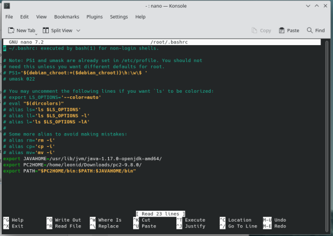
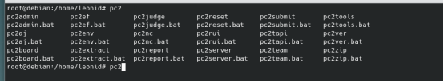
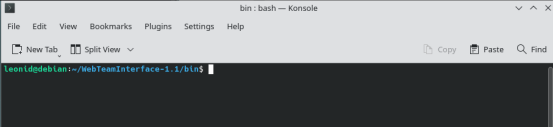

### jedgement_system :bomb:
## Руководство пользователя для установки и запуска PC^2
Следуйте этим шагам, чтобы установить и настроить PC^2 на вашем компьютере:
## Шаг 1: Установка Java
Для начала установите Java с помощью следующих команд:
```diff
+ sudo apt update
+ sudo apt install default-jre
+ sudo apt install default-jdk
```
## Шаг 2: Распаковка архив с github
Файл  "pc2v9.ini" переместите в вашу домашнюю директорию "/home/ваш_пользователь/".
Откройте файл `~/.bashrc` в любом текстовом редакторе, например, `nano`.
В конце файла `~/.bashrc` добавьте следующие переменные среды:
```diff
export JAVAHOME=Путь_до_openjdk-amd64/ (указывая путь до OpenJDK)
export PC2HOME=Путь_до_PC^2 (указывая путь до распакованной папки PC^2)
export PATH="$PC2HOME/bin:$PATH:$JAVAHOME/bin" (добавьте эти пути к переменной $PATH)
```
Пример:<br />


## Шаг 4: Настройка Scoreboard для WebTeamInterface
Для запуска веб-сервера, вам понадобится отдельная scoreboard для WebTeamInterface.Вам понадобится отдельный пользователь scoreboard в pc2admin
Все настройки веб-интерфейса можно изменить в этом файле  "pc2v9.ini" , который находится в папке "WebTeamInterface"
## Запуск
Откройте терминал и введите команду "pc2", затем дважды нажмите TAB. Вы должны увидеть следующее:
<br />
Если подсказки по командам не появились, попробуйте выполнить ту же команду от имени пользователя root.
<br />Для запуска системы выполните команду:
```diff
pc2server
```
Вход в систему осуществляется с помощью стандартных учетных данных: логин "site1", пароль: "site1".
<br />Откройте новое окно терминала или запустите новую сессию "screen" и выполните команду:
```diff
pc2admin
```
Логин: "root", пароль: "administrator1".
### Для запуска веб-интерфейса откройте терминал и перейдите в директорию "WebTeamInterface/bin/".<br />
<br />
Запустите скрипт "pc2wti" с помощью команды:
```diff
bash pc2wti
```
#### Веб-интерфейс будет доступен по адресу "localhost:8080", если вы не изменили настройки в файле "pc2v9.ini" в папке "WebTeamInterface".
[Официальная документация](https://pc2ccs.github.io/current/)
